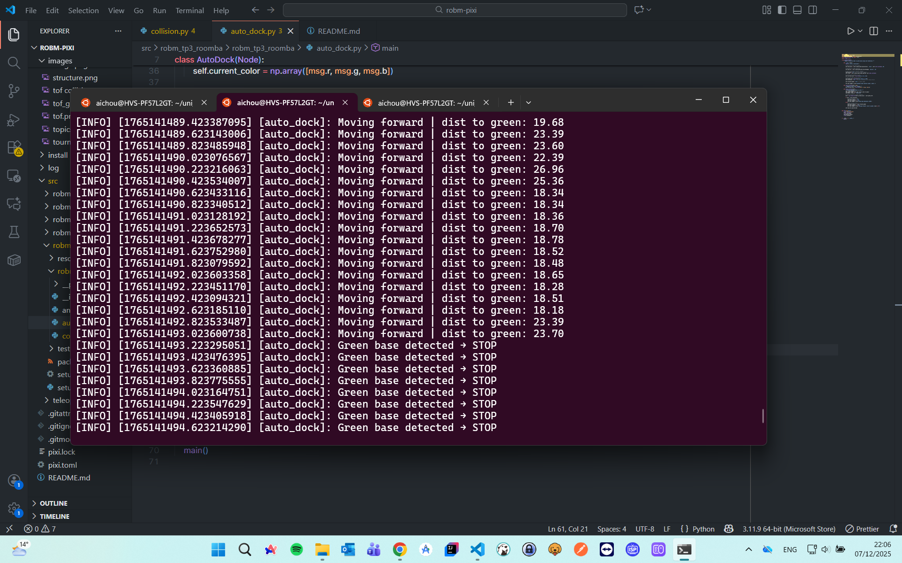
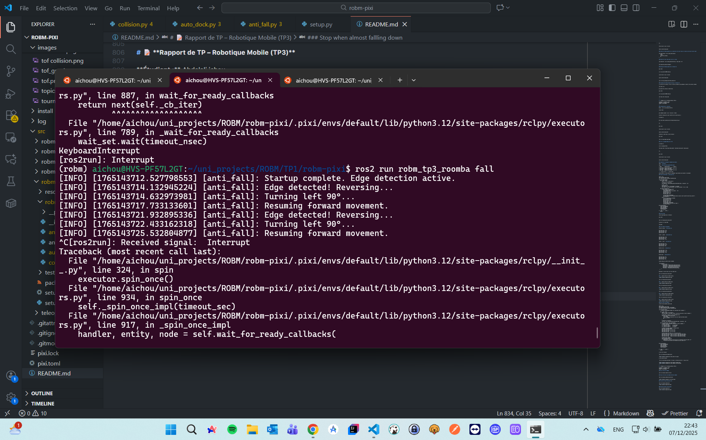
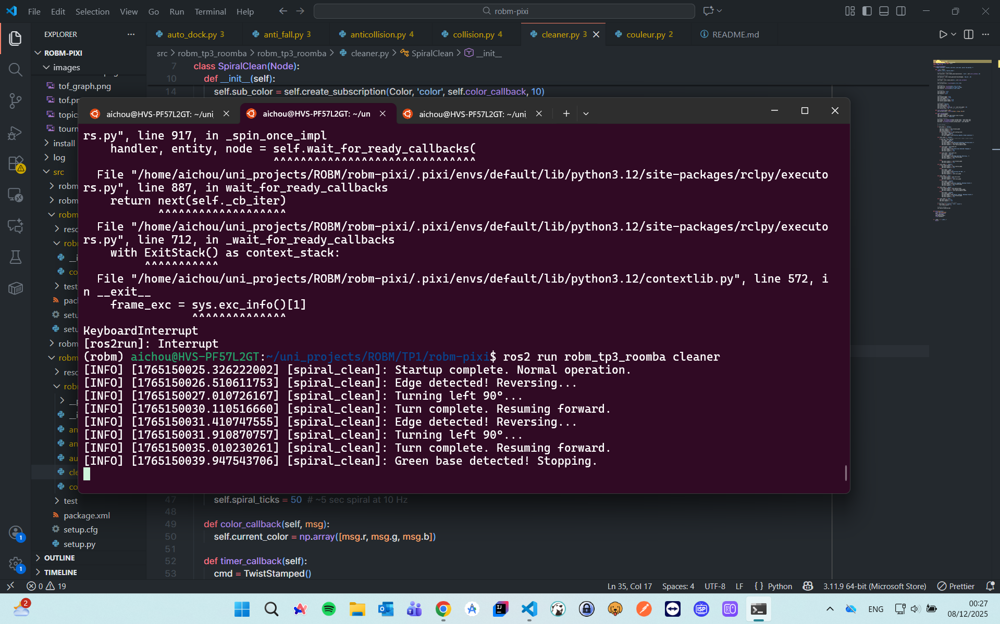
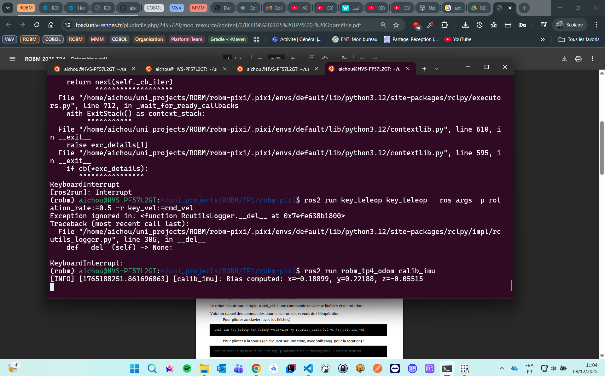
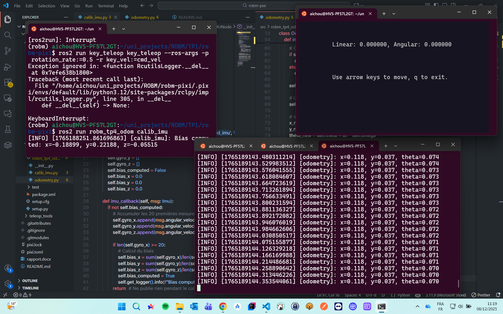

# 📝 **Rapport de TP – Robotique Mobile (TP1)**

**Étudiant :** Abdelali ichou
**Groupe :** Group1, M2 ILA
**Date :** 01-12-2025

---

# **1. Assemblage du robot**

### ✔️ Objectif

Assembler le robot mobile à partir des composants fournis : M5StickC Plus, RoverC, servomoteur, capteurs ToF, couleur, ultrasons, LEGO, câbles Grove.

### ✔️ Description

Le robot a été assemblé en suivant le livret fourni sur Moodle.
Tous les modules ont été connectés à l’aide des ports Grove conformément aux instructions.

### 📸 _Photo de mon robot assemblé_


---

# **2. Mise en route du robot**

### ✔️ Allumage

- M5StickC Plus activé via le bouton arrière-gauche

### ✔️ Connexion WiFi

- Réseau : `ROBM_Moulitine`
- Mot de passe : `WALL-E!SuzanCalvin`

---

# **3. Utilisation de Pixi ROS2**

### ✔️ Démarrage de l’environnement ROS

```
pixi shell
```

### ✔️ Lancement du pont UDP

```
pixi run udp_bridge
```

Cette commande active la communication entre le robot et ROS2.

### 📸 _Capture d’écran : communication avec le robot_


---

# **4. Exploration des topics ROS2**

### ✔️ Liste des topics ROS2

Commande utilisée :

```
ros2 topic list
```

### 📸 _Capture d’écran : liste des topics_


---

# **5. Lecture des données des capteurs**

## **5.1 Capteur ToF (distance)**

### ✔️ Lecture des données

```
ros2 topic echo /tof
```

### 📸 _Capture d’écran : capture du distance_


### **Question : Que se passe-t-il parfois avec les mesures ?**

**Réponse :**
Le capteur ToF renvoie parfois des valeurs incorrectes (0, très grandes valeurs).
Cela se produit lorsque :

- l’objet est trop loin
- le capteur est trop proche de l’objet

### 📈 Affichage dans _rqt_

- Ajout d’un onglet `Plugins/visualization/plot`
- Ajout d’un `topic/range`

### 📸 _Capture d’écran du graphe ToF dans rqt GUI_


---

## **5.2 Capteur Couleur**

### ✔️ Lecture des données

```
ros2 topic echo /color
```

### **Question : Quelles valeurs pour différents sols ?**

Voici mes mesures :

| Type de sol | R   | G   | B   | Luminosité |
| ----------- | --- | --- | --- | ---------- |
| Bleu        | 1   | 13  | 59  | 37         |
| Green       | 6   | 32  | 12  | 210        |
| Rouge       | 51  | 6   | 8   | 50         |

### 📸 _Capture d’écran du Rouge_


### 📸 _Capture d’écran du Blue_


### 📸 _Capture d’écran du Green_


### **Question : À quoi sert ce capteur ?**

**Réponse :**

- Reconnaissance de surfaces
- Détection de zones colorées

---

# **6. Développement d’un nœud ROS2 : Détection de couleur**

## **6.1 Création du package**

Commande utilisée :

```
cd src
```

```
ros2 pkg create --build-type ament_python --node-name couleur robm_tp1_color
```

```
cd ..
```

```
colcon build or pixi run build
```

```
source install/setup.bash
```

### 📸 _Capture de l’arborescence du package_


---

## **6.2 Code du nœud : abonnement au capteur couleur**

Voici le code utilisé :

```python
import rclpy
from rclpy.node import Node
from robm_interfaces.msg import Color
from std_msgs.msg import String
import numpy as np

class ColorDetector(Node):
    def __init__(self):
        super().__init__('couleur')

        self.subscription = self.create_subscription(
            Color,
            'color',
            self.callback_color,
            10
        )

        self.publisher = self.create_publisher(String, 'nom_couleur', 10)

        # Valeurs des couleurs mesurées auparavant
        self.known_colors = {
            "blanc": np.array([200, 200, 200]),
            "noir":  np.array([10, 10, 10]),
            "rouge": np.array([180, 40, 30]),
            "vert":  np.array([40, 180, 40]),
            "bleu":  np.array([30, 40, 180])
        }

    def callback_color(self, msg):
        current = np.array([msg.r, msg.g, msg.b])

        distances = {name: np.linalg.norm(current - ref)
                     for name, ref in self.known_colors.items()}

        detected = min(distances, key=distances.get)

        msg_out = String()
        msg_out.data = detected
        self.publisher.publish(msg_out)

        self.get_logger().info(f"Couleur détectée : {detected}")

def main(args=None):
    rclpy.init(args=args)
    node = ColorDetector()
    rclpy.spin(node)
    node.destroy_node()
    rclpy.shutdown()
```

---

## **6.3 Test du nœud**

### ✔️ Lancement

```
pixi shell
```

```
cd ~/uni_projects/ROBM/robm-pixi
```

```
colcon build or pixi run build
```

```
source install/setup.bash
```

```
ros2 run robm_tp1_color couleur
```

### ✔️ Observation du topic :

```
ros2 topic echo /nom_couleur
```

### 📸 _Capture : topic nom_couleur_

```

```

---

# **7. Visualisation du réseau ROS : rqt_graph**

```
rqt_graph
```

Le schéma attendu :

```
/color  --->  /couleur  --->  /nom_couleur
```

### 📸 _Capture d’écran du graphe ROS2_

```

```

---

# **8. Problèmes rencontrés**

- difficultés de connexion WiFi
- erreur Python dans le package (ex : rclpy)
- capteur ToF instable
- problème avec rqt qui ne rafraîchit pas & très lent

---

# **9. Conclusion**

Ce TP m’a permis de :

- comprendre & manipuler ROS2 (topics, publishers, subscribers)
- utiliser _rqt_ pour visualiser des données
- développer un nœud ROS2 fonctionnel de détection de couleur
- publier un message personnalisé sur un topic

# 📝 Notes:

### Démarrage de l’environnement ROS

```
pixi shell
```

### Lancement du bridge UDP avec le robot

**You need to be inside shell**

```
pixi shell
```

```
ros2 run robm_bridge udp_bridge
```

### Show all avaible topics with the robot

```
ros2 topic list
```

### Read data from a topic

```
ros2 topic echo /topic
```

```
ros2 topic echo /color
```

```
ros2 topic echo /tof
```

### Creating new topic package

```
cd src (obligatory, so it will be created along side with the robm_interfaces)
```

```
ros2 pkg create --build-type ament_python --node-name Python_noeud_file Topic_package_name
```

```
cd ..
```

```
colcon build or pixi run build
```

```
source install/setup.bash
```

### Inside our Python_noeud_file, we susbsribe to the color topic to receive color data from the robot

```
self.subscription = self.create_subscription(
    Color,
    'color',
    self.color_callback,
    10
)
```

### Publish the real time sensor color to a topic

```
self.publisher = self.create_publisher(String, 'topic_name', 10)
```

```
self.publisher.publish("message")
```

### Running the Python_noeud_file in terminal N1

```
pixi shell
```

```
cd ~/uni_projects/ROBM/robm-pixi
```

```
colcon build or pixi run build
```

```
source install/setup.bash
```

```
ros2 run Topic_package_name Python_noeud_file
```

### Consuming the Python_noeud_file topic in terminal N2

if we show all the topics, we will se the one created by the package we runned in the previous command

```
ros2 topic list
```

We consume this previous created topic

```
pixi shell
```

```
cd ~/uni_projects/ROBM/robm-pixi
```

```
ros2 topic echo /topic_name
```

---

# 📝 **Rapport de TP – Robotique Mobile (TP2)**

**Étudiant :** Abdelali ichou
**Groupe :** Group1, M2 ILA
**Date :** 01-12-2025

---

### Configuration du réparation

Mettre à jour le sous-module ROS Pixi

```
cd pixi home
```

```
git submodule update --init --recursive --remote
```

Installer teleop_tools (pour contrôler avec clavier/souris) :

```
cd <home>/src
```

```
git clone https://github.com/ros-teleop/teleop_tools.git
```

```
cd ..
```

```
pixi shell
```

```
colcon build or pixi run build
```

```
source install/setup.bash
```

Connexion au robot dans un autre terminal :

```
pixi shell
```

```
ros2 run robm_bridge udp_bridge
```

### Créer le package ROS2 pour le TP2

```
cd <home>/src
```

Créer le package Python

```
ros2 pkg create --build-type ament_python --node-name avance_motor robm_tp2_move
```

```
cd ..
```

```
pixi shell
```

```
colcon build or pixi run build
```

```
source install/setup.bash
```

### Comprendre le message de commande des moteurs

Topic : `cmd_motors`

Type : `robm_interfaces/msg/RoverMotorsCmd`

| Champ       | Signification         | Valeur |
| ----------- | --------------------- | ------ |
| front_left  | moteur avant gauche   | -1 à 1 |
| front_right | moteur avant droit    | -1 à 1 |
| rear_left   | moteur arrière gauche | -1 à 1 |
| rear_right  | moteur arrière droit  | -1 à 1 |

`-1` → plein arrière, `1` → plein avant

Contrôle PWM → il faut envoyer les commandes régulièrement pour maintenir le mouvement

### Code de nœud Python : avance_motor.py

```
import rclpy
from rclpy.node import Node
from robm_interfaces.msg import RoverMotorsCmd

class AvanceMotor(Node):
    def __init__(self):
        super().__init__('avance_motor')

        # Publisher vers cmd_motors
        self.publisher = self.create_publisher(RoverMotorsCmd, 'cmd_motors', 10)

        # Timer à 10 Hz
        self.counter = 0
        self.max_count = 20  # 20 messages → 2 secondes
        self.timer = self.create_timer(0.1, self.timer_callback)  # 0.1s = 10Hz

    def timer_callback(self):
        if self.counter < self.max_count:
            msg = RoverMotorsCmd()
            # Déplacement avant : tous moteurs à +0.5
            msg.front_left = 0.5
            msg.front_right = 0.5
            msg.rear_left = 0.5
            msg.rear_right = 0.5

            self.publisher.publish(msg)
            self.get_logger().info(f"Commande moteur envoyée ({self.counter+1}/{self.max_count})")
            self.counter += 1
        else:
            # Stop le robot après 2 secondes
            msg = RoverMotorsCmd()
            msg.front_left = 0.0
            msg.front_right = 0.0
            msg.rear_left = 0.0
            msg.rear_right = 0.0
            self.publisher.publish(msg)
            self.get_logger().info("Arrêt du robot.")
            self.timer.cancel()

def main(args=None):
    rclpy.init(args=args)
    node = AvanceMotor()
    rclpy.spin(node)
    node.destroy_node()
    rclpy.shutdown()

if __name__ == '__main__':
    main()
```

### Test du nœud

Lancer udp_bridge dans un terminal1

```
pixi shell
```

```
ros2 run robm_tp2_move avance_motor
```

Visualiser le réseau ROS2

```
rqt_graph
```

### Créer d’autres mouvements

Tourne sur place : `tourne_motor.py`

```
msg.front_left = -0.5
msg.front_right = 0.5
msg.rear_left = -0.5
msg.rear_right = 0.5
```

Tourner à gauche : `gauche_motor.py`

```
msg.front_left = -0.5
msg.front_right = 0.5
msg.rear_left = 0.5
msg.rear_right = -0.5
```

Tourner à droit : `droit_motor.py`

```
msg.front_left = 0.5
msg.front_right = -0.5
msg.rear_left = -0.5
msg.rear_right = 0.5
```

Marche arrière : `back_motor.py`

```
msg.front_left = -1.0
msg.front_right = -1.0
msg.rear_left = -1.0
msg.rear_right = -1.0
```

Marche avant : `avance_motor.py`

```
msg.front_left = 0.5
msg.front_right = 0.5
msg.rear_left = 0.5
msg.rear_right = 0.5
```

Inside setup.py we add the shell commands

```
 entry_points={
      'console_scripts': [
          'avance_motor = robm_tp2_move.avance_motor:main',
          'gauche_motor = robm_tp2_move.gauche_motor:main',
          'tourne_motor = robm_tp2_move.tourne_motor:main',
          'back_motor = robm_tp2_move.back_motor:main',
          'droit_motor = robm_tp2_move.droit_motor:main',
      ],
  },
```

Maintenant, tu peux lancer tes trois nœuds avec :

```
ros2 run robm_tp2_move avance_motor
```

### 📸 _Capture d’écran du Robot avance_


```
ros2 run robm_tp2_move back_motor
```

### 📸 _Capture d’écran du Robot back_


```
ros2 run robm_tp2_move droit_motor
```

### 📸 _Capture d’écran du Robot droit_


```
ros2 run robm_tp2_move gauche_motor
```

### 📸 _Capture d’écran du Robot gauche_


```
ros2 run robm_tp2_move tourne_motor
```

### 📸 _Capture d’écran du Robot tourne_


### Move robot with keyboard

create the new movement python node

```
import rclpy
from rclpy.node import Node
from geometry_msgs.msg import TwistStamped
from robm_interfaces.msg import RoverMotorsCmd

class VelToMotor(Node):
    """Converts TwistStamped messages into individual motor commands."""

    def __init__(self):
        super().__init__('vel_to_motor')
        self.get_logger().info("Node started: converting velocities to motor commands.")

        # Subscriber to cmd_vel or any TwistStamped topic
        self.sub = self.create_subscription(
            TwistStamped,
            'vel',  # topic to subscribe to (you can remap key_teleop output)
            self.vel_callback,
            10
        )

        # Publisher to cmd_motors
        self.pub = self.create_publisher(RoverMotorsCmd, 'cmd_motors', 10)

    def vel_callback(self, msg: TwistStamped):
        """Convert linear and angular velocities to motor commands."""
        # Extract velocities
        vx = msg.twist.linear.x      # forward/back
        vy = msg.twist.linear.y      # left/right
        wz = msg.twist.angular.z     # rotation

        # Compute each wheel command for Mecanum robot
        motor_cmd = RoverMotorsCmd()
        motor_cmd.front_left  = vx - vy - wz
        motor_cmd.front_right = vx + vy + wz
        motor_cmd.rear_left   = vx + vy - wz
        motor_cmd.rear_right  = vx - vy + wz

        # Ensure values are within [-1, 1] for motor driver
        motor_cmd.front_left  = max(-1.0, min(1.0, motor_cmd.front_left))
        motor_cmd.front_right = max(-1.0, min(1.0, motor_cmd.front_right))
        motor_cmd.rear_left   = max(-1.0, min(1.0, motor_cmd.rear_left))
        motor_cmd.rear_right  = max(-1.0, min(1.0, motor_cmd.rear_right))

        # Publish motor command
        self.pub.publish(motor_cmd)
        self.get_logger().info(
            f"Motors cmd | FL:{motor_cmd.front_left:.2f} FR:{motor_cmd.front_right:.2f} "
            f"RL:{motor_cmd.rear_left:.2f} RR:{motor_cmd.rear_right:.2f}"
        )


def main(args=None):
    rclpy.init(args=args)
    node = VelToMotor()
    rclpy.spin(node)
    node.destroy_node()
    rclpy.shutdown()


if __name__ == "__main__":
    main()
```

in the first terminal

```
ros2 run robm_tp2_move dynamic_motor
```


in the second terminal

```
 ros2 run key_teleop key_teleop --ros-args -p rotation_rate:=0.5 -r key_vel:=vel
```


### Move robot with keyboard

We will the predefined keyboard commands, we dont need to run our 3rd script

```
ros2 run key_teleop key_teleop --ros-args -p rotation_rate:=0.5 -r key_vel:=cmd_vel
```


---

### Move robot with Mouse

```
ros2 run mouse_teleop mouse_teleop --ros-args -p holonomic:=True -p frequency:=10.0 -r mouse_vel:=cmd_vel
```

---

# 📝 **Rapport de TP – Robotique Mobile (TP3)**

**Étudiant :** Abdelali ichou
**Groupe :** Group1, M2 ILA
**Date :** 07-12-2025

### Sop on the wall command

```
ros2 run robm_tp3_roomba collision
```

```
iimport rclpy
from rclpy.node import Node

from geometry_msgs.msg import TwistStamped
from sensor_msgs.msg import Range


class Anticollision(Node):
    """Improved anticollision with smoother, slower behavior and 90° turn."""
    def __init__(self):
        super().__init__('anticollision')

        self.sub_tof = self.create_subscription(
            Range, 'tof', self.tof_callback, 10
        )

        self.pub_vel = self.create_publisher(TwistStamped, 'cmd_vel', 10)

        # Slower timer → smoother reactions (10 Hz instead of 20 Hz)
        self.timer = self.create_timer(0.1, self.timer_callback)

        self.current_range = None

        # For smooth speed change
        self.current_speed = 0.0

    def tof_callback(self, msg: Range):
        """Save distance from TOF sensor."""
        self.current_range = msg.range

    def timer_callback(self):
        msg = TwistStamped()
        msg.header.stamp = self.get_clock().now().to_msg()
        msg.header.frame_id = 'base_link'

        if self.current_range is None:
            msg.twist.linear.x = 0.0
            self.pub_vel.publish(msg)
            return

        d = self.current_range

        # ===== NEW THRESHOLDS =====
        safe_distance = 0.80      # Start slowing earlier
        stop_distance = 0.30    # At this distance → turn left

        # ===== NEW SPEEDS =====
        max_speed = 0.20          # Much slower
        min_speed = 0.05

        # ===== Behavior rules =====

        # 1) Obstacle extremely close → turn LEFT 90°
        if d < stop_distance:
            msg.twist.linear.x = 0.0
            msg.twist.angular.z = 1.2     # turn left smoothly
            self.pub_vel.publish(msg)
            self.get_logger().info("TOO CLOSE → Turning left")
            return

        # 2) Between stop_distance and safe_distance → slow down
        if stop_distance <= d < safe_distance:
            # Linear scale from max_speed → min_speed
            speed = min_speed + (max_speed - min_speed) * ((d - stop_distance) / (safe_distance - stop_distance))
        else:
            # 3) Far away → full slow speed
            speed = max_speed

        # Smooth motion (avoid jerky behavior)
        alpha = 0.2  # smoothing factor
        self.current_speed = alpha * speed + (1 - alpha) * self.current_speed

        # Apply forward speed
        msg.twist.linear.x = float(self.current_speed)
        msg.twist.angular.z = 0.0

        self.pub_vel.publish(msg)
        self.get_logger().info(f"Distance: {d:.2f} m → vx: {self.current_speed:.2f}")


def main(args=None):
    rclpy.init(args=args)
    node = Anticollision()
    rclpy.spin(node)
    node.destroy_node()
    rclpy.shutdown()


if __name__ == '__main__':
    main()
```

### Stop on the wall and change direction command

```
ros2 run robm_tp3_roomba anticollision
```

```
import rclpy
from rclpy.node import Node

from geometry_msgs.msg import TwistStamped
from sensor_msgs.msg import Range


class Anticollision(Node):
    """Move forward, slow down near walls, reverse when too close."""

    def __init__(self):
        super().__init__('anticollision')

        # Subscribe to ToF sensor ("tof")
        self.sub_tof = self.create_subscription(
            Range,
            'tof',
            self.tof_callback,
            10
        )

        # Publish TwistStamped to cmd_vel
        self.pub_vel = self.create_publisher(
            TwistStamped,
            'cmd_vel',
            10
        )

        # Timer: 20 Hz
        self.timer = self.create_timer(0.05, self.timer_callback)

        # Last measured distance (meters)
        self.current_range = 1.0   # default = safe distance

        self.get_logger().info("Anticollision node started.")

    # -------------------------------
    # TOF CALLBACK
    # -------------------------------
    def tof_callback(self, msg: Range):
        """Save the measured range from the ToF sensor."""
        self.current_range = msg.range   # <-- real distance in meters

    # -------------------------------
    # CONTROL LOOP (20 Hz)
    # -------------------------------
    def timer_callback(self):
        msg = TwistStamped()
        msg.header.stamp = self.get_clock().now().to_msg()
        msg.header.frame_id = 'base_link'

        d = self.current_range   # short alias

        # --- BEHAVIOR RULES ---
        if d > 0.50:
            # Normal forward speed (0.3 m/s)
            vx = 0.2

        elif 0.20 < d <= 0.50:
            # Slow down linearly
            # when d = 0.50 → vx = 0.30
            # when d = 0.20 → vx = 0.00
            vx = 0.30 * (d - 0.20) / (0.50 - 0.20)

        else:
            # d < 0.20 → reverse proportionally
            # when d = 0.20 → 0.0
            # when d = 0.05 → -0.25 (example)
            min_dist = 0.05
            d_clamped = max(d, min_dist)
            vx = -0.2 * (0.20 - d_clamped) / (0.20 - min_dist)

        # Set TwistStamped fields
        msg.twist.linear.x = float(vx)
        msg.twist.linear.y = 0.0
        msg.twist.angular.z = 0.0

        # Publish
        self.pub_vel.publish(msg)

        # Debug
        self.get_logger().info(
            f"Distance={d:.2f} m → vx={vx:.2f} m/s"
        )


def main(args=None):
    rclpy.init(args=args)
    node = Anticollision()
    rclpy.spin(node)
    node.destroy_node()
    rclpy.shutdown()


if __name__ == '__main__':
    main()
```


### Stop when facing the green color

```
ros2 run robm_tp3_roomba dock
```

```
import rclpy
from rclpy.node import Node
from geometry_msgs.msg import TwistStamped
from robm_interfaces.msg import Color
import numpy as np

class AutoDock(Node):
    """Node to stop the robot on green base using color detection."""

    def __init__(self):
        super().__init__('auto_dock')

        # Subscribe to the color sensor
        self.sub_color = self.create_subscription(Color, 'color', self.color_callback, 10)

        # Publisher for robot velocity
        self.pub_vel = self.create_publisher(TwistStamped, 'cmd_vel', 10)

        # Timer for periodic velocity commands
        timer_period = 0.2  # 5 Hz for slower updates
        self.timer = self.create_timer(timer_period, self.timer_callback)

        # Current color reading (r,g,b)
        self.current_color = np.array([0.0, 0.0, 0.0])

        # Green base RGB measured earlier
        self.green_ref = np.array([7.31, 30.83, 12.60])
        self.tolerance = 8.0  # Increase tolerance so it stops earlier

        self.forward_speed = 0.05  # slower speed

        self.get_logger().info("AutoDock node started (slower, safer).")

    def color_callback(self, msg):
        """Update current color reading."""
        self.current_color = np.array([msg.r, msg.g, msg.b])

    def timer_callback(self):
        """Publish velocity based on color."""
        cmd = TwistStamped()
        cmd.header.stamp = self.get_clock().now().to_msg()
        cmd.header.frame_id = 'base_link'

        # Compute distance to green reference
        dist = np.linalg.norm(self.current_color - self.green_ref)

        if dist < self.tolerance:
            # Green detected → stop
            cmd.twist.linear.x = 0.0
            cmd.twist.angular.z = 0.0
            self.get_logger().info("Green base detected → STOP")
        else:
            # Move forward slowly
            cmd.twist.linear.x = self.forward_speed
            cmd.twist.angular.z = 0.0
            self.get_logger().info(f"Moving forward | dist to green: {dist:.2f}")

        self.pub_vel.publish(cmd)


def main(args=None):
    rclpy.init(args=args)
    node = AutoDock()
    rclpy.spin(node)
    node.destroy_node()
    rclpy.shutdown()


if __name__ == "__main__":
    main()
```



### Stop when almost fallling down

```
ros2 run robm_tp3_roomba fall
```

```
import rclpy
from rclpy.node import Node
from geometry_msgs.msg import TwistStamped
from robm_interfaces.msg import Color
import numpy as np

class AntiFall(Node):
    """Anti-fall node using color detection with precise left turn."""

    def __init__(self):
        super().__init__('anti_fall')

        # Subscribe to color sensor
        self.sub_color = self.create_subscription(Color, 'color', self.color_callback, 10)

        # Publisher for robot velocity
        self.pub_vel = self.create_publisher(TwistStamped, 'cmd_vel', 10)

        # Timer for main loop (10 Hz)
        self.timer = self.create_timer(0.1, self.timer_callback)

        # Current color
        self.current_color = np.array([0.0, 0.0, 0.0])

        # Floor reference (set to your safe floor color)
        self.floor_ref = np.array([8.0, 16.0, 27.0])
        self.tolerance = 10.0  # increase for earlier detection

        # Speeds
        self.forward_speed = 0.05
        self.reverse_speed = -0.15
        self.turn_speed = 0.5  # rad/s

        # State machine: 'startup', 'forward', 'reverse', 'turn'
        self.state = 'startup'
        self.state_counter = 0  # counts timer ticks in current state

        # Grace period before checking for cliff (1 sec at 10 Hz)
        self.startup_ticks = 10

        # Turn duration in ticks for 90° turn
        self.turn_ticks = int((np.pi / 2) / self.turn_speed * 10)  # 10 Hz timer

    def color_callback(self, msg):
        self.current_color = np.array([msg.r, msg.g, msg.b])

    def timer_callback(self):
        cmd = TwistStamped()
        cmd.header.stamp = self.get_clock().now().to_msg()
        cmd.header.frame_id = 'base_link'

        dist = np.linalg.norm(self.current_color - self.floor_ref)

        if self.state == 'startup':
            # Initial grace period: just go forward without checking
            cmd.twist.linear.x = self.forward_speed
            cmd.twist.angular.z = 0.0
            self.state_counter += 1
            if self.state_counter >= self.startup_ticks:
                self.state = 'forward'
                self.state_counter = 0
                self.get_logger().info("Startup complete. Edge detection active.")

        elif self.state == 'forward':
            if dist > self.tolerance:
                # Detected cliff → switch to reverse
                self.state = 'reverse'
                self.state_counter = 0
                self.get_logger().info("Edge detected! Reversing...")
                cmd.twist.linear.x = self.reverse_speed
                cmd.twist.angular.z = 0.0
            else:
                cmd.twist.linear.x = self.forward_speed
                cmd.twist.angular.z = 0.0

        elif self.state == 'reverse':
            # Reverse for ~0.5 sec (5 ticks at 10Hz)
            if self.state_counter < 5:
                cmd.twist.linear.x = self.reverse_speed
                cmd.twist.angular.z = 0.0
            else:
                # After reversing, start turning left
                self.state = 'turn'
                self.state_counter = 0
                self.get_logger().info("Turning left 90°...")
                cmd.twist.linear.x = 0.0
                cmd.twist.angular.z = self.turn_speed  # positive = left

        elif self.state == 'turn':
            if self.state_counter < self.turn_ticks:
                cmd.twist.linear.x = 0.0
                cmd.twist.angular.z = self.turn_speed
            else:
                # Finished turn → resume forward
                self.state = 'forward'
                self.state_counter = 0
                cmd.twist.linear.x = self.forward_speed
                cmd.twist.angular.z = 0.0
                self.get_logger().info("Resuming forward movement.")

        # Only increment state_counter for reverse/turn states
        if self.state not in ['startup', 'forward']:
            self.state_counter += 1

        self.pub_vel.publish(cmd)


def main(args=None):
    rclpy.init(args=args)
    node = AntiFall()
    rclpy.spin(node)
    node.destroy_node()
    rclpy.shutdown()


if __name__ == "__main__":
    main()
```



### Robot nettoyeur with all what we've done before

```
ros2 run robm_tp3_roomba cleaner
```

```
import rclpy
from rclpy.node import Node
from geometry_msgs.msg import TwistStamped
from robm_interfaces.msg import Color
import numpy as np

class SpiralClean(Node):
    """Robot nettoyeur: forward, anti-fall, auto dock, spiral red patches."""

    def __init__(self):
        super().__init__('spiral_clean')

        # Color sensor subscription
        self.sub_color = self.create_subscription(Color, 'color', self.color_callback, 10)

        # Velocity publisher
        self.pub_vel = self.create_publisher(TwistStamped, 'cmd_vel', 10)

        # Timer (10 Hz)
        self.timer = self.create_timer(0.1, self.timer_callback)

        # Current color
        self.current_color = np.array([0.0, 0.0, 0.0])

        # References
        self.floor_ref = np.array([8.0, 16.0, 27.0])
        self.green_ref = np.array([7.31, 30.83, 12.60])
        self.red_ref = np.array([48.0, 6.90, 8.94])

        # Tolerances
        self.floor_tol = 10.0
        self.green_tol = 8.0
        self.red_tol = 12.0

        # Speeds
        self.forward_speed = 0.05
        self.reverse_speed = -0.15
        self.turn_speed = 0.5
        self.spiral_linear_speed = 0.04
        self.spiral_angular_speed = 0.3

        # State machine
        self.state = 'startup'
        self.state_counter = 0
        self.startup_ticks = 10
        self.turn_ticks = int((np.pi / 2) / self.turn_speed * 10)
        self.spiral_ticks = 50  # ~5 sec spiral at 10 Hz

    def color_callback(self, msg):
        self.current_color = np.array([msg.r, msg.g, msg.b])

    def timer_callback(self):
        cmd = TwistStamped()
        cmd.header.stamp = self.get_clock().now().to_msg()
        cmd.header.frame_id = 'base_link'

        # Compute distances
        dist_floor = np.linalg.norm(self.current_color - self.floor_ref)
        dist_green = np.linalg.norm(self.current_color - self.green_ref)
        dist_red = np.linalg.norm(self.current_color - self.red_ref)

        # ---------------------
        # STATE MACHINE
        # ---------------------
        if self.state == 'startup':
            # Move forward at start
            cmd.twist.linear.x = self.forward_speed
            cmd.twist.angular.z = 0.0
            self.state_counter += 1
            if self.state_counter >= self.startup_ticks:
                self.state = 'forward'
                self.state_counter = 0
                self.get_logger().info("Startup complete. Normal operation.")

        elif self.state == 'forward':
            # Priority order: red patch → green base → edge → normal forward
            if dist_red < self.red_tol:
                self.state = 'spiral'
                self.state_counter = 0
                self.get_logger().info("Red patch detected! Starting spiral.")
                cmd.twist.linear.x = self.spiral_linear_speed
                cmd.twist.angular.z = self.spiral_angular_speed

            elif dist_green < self.green_tol:
                self.state = 'stop'
                self.get_logger().info("Green base detected! Stopping.")
                cmd.twist.linear.x = 0.0
                cmd.twist.angular.z = 0.0

            elif dist_floor > self.floor_tol:
                self.state = 'reverse'
                self.state_counter = 0
                self.get_logger().info("Edge detected! Reversing...")
                cmd.twist.linear.x = self.reverse_speed
                cmd.twist.angular.z = 0.0

            else:
                cmd.twist.linear.x = self.forward_speed
                cmd.twist.angular.z = 0.0

        elif self.state == 'reverse':
            if self.state_counter < 5:
                cmd.twist.linear.x = self.reverse_speed
                cmd.twist.angular.z = 0.0
            else:
                self.state = 'turn'
                self.state_counter = 0
                self.get_logger().info("Turning left 90°...")
                cmd.twist.linear.x = 0.0
                cmd.twist.angular.z = self.turn_speed

        elif self.state == 'turn':
            if self.state_counter < self.turn_ticks:
                cmd.twist.linear.x = 0.0
                cmd.twist.angular.z = self.turn_speed
            else:
                self.state = 'forward'
                self.state_counter = 0
                self.get_logger().info("Turn complete. Resuming forward.")
                cmd.twist.linear.x = self.forward_speed
                cmd.twist.angular.z = 0.0

        elif self.state == 'spiral':
            if self.state_counter < self.spiral_ticks:
                cmd.twist.linear.x = self.spiral_linear_speed
                cmd.twist.angular.z = self.spiral_angular_speed
            else:
                self.state = 'forward'
                self.state_counter = 0
                self.get_logger().info("Spiral complete. Resuming forward.")
                cmd.twist.linear.x = self.forward_speed
                cmd.twist.angular.z = 0.0

        elif self.state == 'stop':
            cmd.twist.linear.x = 0.0
            cmd.twist.angular.z = 0.0

        # Increment counters for timed states
        if self.state in ['reverse', 'turn', 'spiral']:
            self.state_counter += 1

        # Publish command
        self.pub_vel.publish(cmd)


def main(args=None):
    rclpy.init(args=args)
    node = SpiralClean()
    rclpy.spin(node)
    node.destroy_node()
    rclpy.shutdown()


if __name__ == "__main__":
    main()
```



---

# 📝 **Rapport de TP – Robotique Mobile (TP4)**

**Étudiant :** Abdelali ichou
**Groupe :** Group1, M2 ILA
**Date :** 08-12-2025

### Start callibrating

```
ros2 run robm_tp4_odom calib_imu
```



### Calculating the live localisation

Lancer le nœud de calibrage IMU
```
ros2 run robm_tp4_odom calib_imu
```

Lancer le nœud d’odométrie
```
ros2 run robm_tp4_odom odometry
```

Lancer la télé-opération
```
ros2 run key_teleop key_teleop --ros-args -p rotation_rate:=0.5 -r key_vel:=cmd_vel
```

Lancer RViz2 pour visualiser
```
rviz2
```
Configurer RViz2 :

- Add → By topic → Odometry → odometry

- Sélectionne le topic odometry

- Frame Fixed : odom

- Le repère fixe pour l’odométrie


